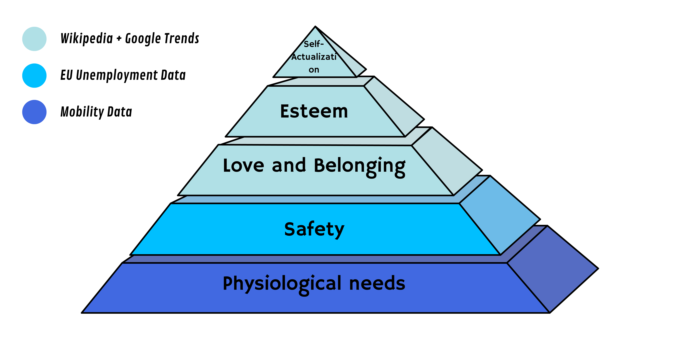

## Abstract

Maslow's Hierarchy of Needs serves as a model for assessing human behavior, offering insights into the profound shifts witnessed during the pandemic. From altered relationship dynamics to revised safety measures and changing professional priorities, our needs underwent a transformative evolution. The pivotal consideration lies in whether the data collected during this critical period truly encapsulates our emotions and intuitions. Is it aligned with Maslow's enduring theory, a testament to its continued dominance in shaping our daily lives? Our study delves into the pandemic-induced changes, exploring whether Maslow's framework remains a relevant and accurate tool for understanding these shifts. By examining the intricacies of the data at hand, we aim to uncover the resonance between our evolving needs and the timeless principles outlined by Maslow's Hierarchy, providing a nuanced perspective on the enduring impact of his theory.

## Research Questions

1. Is Maslow’s “Hierarchy of Needs” theory still applicable during times of abnormalcy?
2. Can a pandemic cause a shift in human needs?
3. Is the base of Maslow’s pyramid (Physiological Needs) completely stable?
4. In what ways might the pursuit of self-actualization be affected by external disruptions, and how can individuals adapt their goals during challenging times?

## Additional Datasets

1. **EU Employment Dataset:**
   - Job applications and searches fall outside the scope of Wikipedia and are integral to Maslow’s 'safety' category. The selected dataset is from Kaggle, specifically the Unemployment in European Union data from the EU open data portal. The analysis focuses on EU citizens due to data availability, with extensive information from Wikipedia searches in European languages. The study utilizes data from 1983 to 2021, specifically during the Covid-19 pandemic, using prior years to establish a baseline for comparison, considering seasonal effects and volume variations (difference in differences).

2. **Google Trends**
3. **Wikipedia Pageviews**
   - Given the broad categorization of topics, we will incorporate both Wikipedia pageviews and Google Trends data to assess the relevance of more specific and niche subjects. The data will span from 2019 to 2021, allowing for an examination of trend evolution before and during the pandemic.
   - Examples of searches relevant to assessing the evolution of each level of Maslow’s pyramid include:
      - **Self-Actualization:** mindfulness, time management, steps to reach life goals,...
      - **Esteem:** communication skills, building a respectful environment,...
      - **Love and Belonging:** online dating, long-distance relationships, divorce,...

## Methods

- **Data Cleaning:**
   - Since our research focuses exclusively on EU countries, it is essential to eliminate all non-EU countries from our datasets.

- **Data Categorization:**
   - To align Wikipedia topics with the corresponding levels on Maslow's Hierarchy of Needs, we will implement a systematic categorization process. Wikipedia topics and Google Trends will predominantly inform these categories, while Mobility data will contribute to understanding Physiological Needs, and EU Unemployment data will be instrumental in assessing Safety Needs.

- **Difference-in-Differences Analysis:**
   - Our examination will explore the changing levels of interest in the categorized topics, correlating with significant timestamps (lockdown, first death, etc). These patterns will be linked to corresponding human needs [1].
   

## References

[1] Jina Suh, Eric Horvitz, Ryen W. White, Tim Althof (2021). Population-Scale Study of Human Needs During the COVID-19 Pandemic: Analysis and Implications

